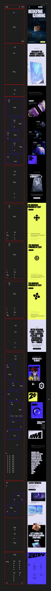
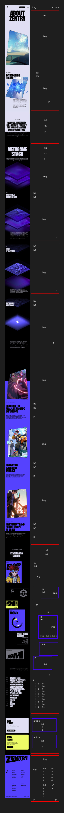
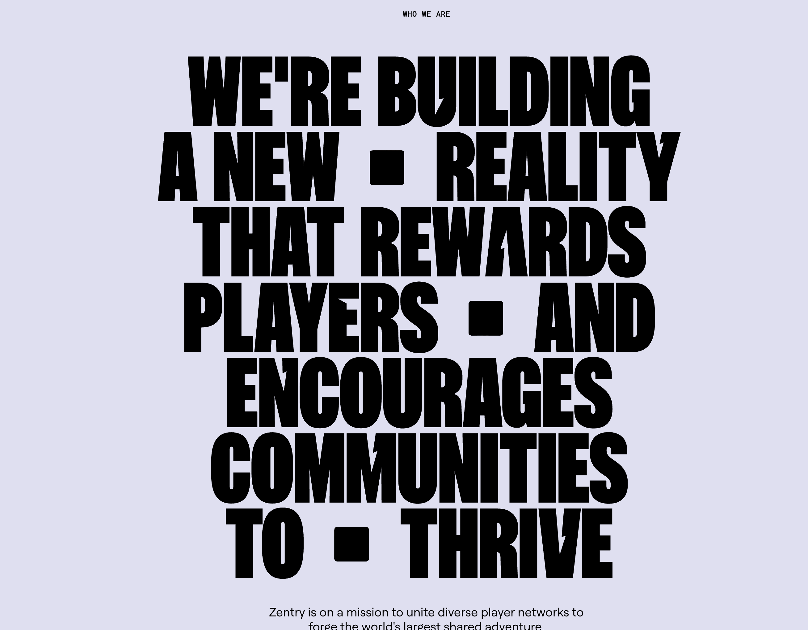

# Procesverslag
Markdown is een simpele manier om HTML te schrijven.  
Markdown cheat cheet: [Hulp bij het schrijven van Markdown](https://github.com/adam-p/markdown-here/wiki/Markdown-Cheatsheet).

Nb. De standaardstructuur en de spartaanse opmaak van de README.md zijn helemaal prima. Het gaat om de inhoud van je procesverslag. Besteedt de tijd voor pracht en praal aan je website.

Nb. Door *open* toe te voegen aan een *details* element kun je deze standaard open zetten. Fijn om dat steeds voor de relevante stuk(ken) te doen.

## Jij

  
uitwerken voor kick-off werkgroep

  ### Auteur:
  Manuel den Hartog

  #### Je startniveau:
  rood

  #### Je focus:
  Responsive
 

## Je website

  
uitwerken voor kick-off werkgroep

  ### Je opdracht:
  https://zentry.com/

  #### Screenshot(s) van de eerste pagina (small screen): 
  home 
  

  #### Screenshot(s) van de tweede pagina (small screen):
  about
  
 

## Toegankelijkheidstest 1/2 (week 1)

  
uitwerken na test in 2e werkgroep

  ### Bevindingen
  Lijst met je bevindingen die in de test naar voren kwamen:
  -  Met een gaatjesbril is de website nogsteeds prima te navigeren, het is uiteraard wel een stuk lastiger maar alle elementen staan niet op heel veel verschillende plekken dus moet je niet veel rondkijken op het scherm
  - Omdat er niet teveel elementen per sectie zijn is het ook niet heel moeilijk om de website door te navigeren als je concentratieproblemen hebt. Ook helpt het voor mijn gevoel dat er een animatie is op elementen als ze in je viewport komen waardoor je een soort van begeleid wordt met waar je naar moet kijken. Wel kunnen die juist ook wel afleidend zijn, zo is er bij een bepaalde sectie altijd een gifje op loop aan het afspelen is die best groot in beeld staat. En staat de tekst die daar gelezen moet worden linksonder in het klein. 
  - Met een spasmes/parkinson nabootser is het vrijwel onmogelijk om op een website uberhaupt goed rond te navigeren, dus dit was ook het geval op mijn website. Ik had de spasme nabootser wel op een best heftige stand staan dus dat was sowieso al moeilijk, als het een wat lichtere versie was was het wel goed mogelijk geweest om rond te navigeren op mijn website. Ook omdat knoppen vaak niet bij elkaar in de buurt staan. 
  - De voiceover op mijn site werkte niet heel goed. Zo worden alle heading in stukjes opgelezen omdat er in de tekst speciale letters zitten. Dus bij bijvoorbeeld "discover" is de letter o een speciale letter (qua font) dus leest de voiceover het op als disc-o-ver. Dit werkt dus niet heel goed. De broodteksten die er zijn worden wel goed opgelezen.

## Breakdownschets (+week 1)

  
uitwerken na afloop 3e werkgroep

  ### de hele pagina: 
  

  ### about pagina: 
  

## Voortgang 1 (week 2)

  
uitwerken voor 1e voortgang

  ### Stand van zaken
  Ik heb de HTML van de homepagina gemaakt alleen twijfel ik nog of sommige dingen semantisch zijn. Ook heb ik nog niet heel duidelijk wanneer ik wel een div mag gebruiken en wanneer niet. Zo weet ik bijvoorbeeld niet hoe ik de zwarte blokjes (zie afbeelding) moet gaan doen in de HTML. 
  

Ook twijfel ik nog of ik sommige secties wel echt een section mag noemen aangezien ze niet beginnen met een heading.

  ### Agenda voor meeting
  samen met je groepje opstellen

  | Manuel         | Vincent            | Nerusha      | student 4        |
  | ---            | ---                | ---          | ---              |
  | dit bespreken  | en dit             | en ik dit    | en dan ik dat    |
  | en dat ook nog | dit als er tijd is | nog een punt | dit wil ik zeker |
  | ...            | ...                | ...          | ...              |

Punten Manuel: 
- Wanneer div?
- Mogen background images?
- Sections zonder heading.

  ### Verslag van meeting
  hier na afloop snel de uitkomsten van de meeting vastleggen

  - Ik moet de title en favicon nog aanpassen.
  - In mijn header heb ik de video voor de h1 gezet.
  - Kleine articles moeten list items worden
  - Per section een class maken zodat je niet heel veel classes hebt.
  - Divjes mogen bij stijling
  - Background images mag je niet gebruiken

## Voortgang 2 (week 3)

  
uitwerken voor 2e voortgang

  ### Stand van zaken
  Ik ben nu bezig met de CSS en heb ook al het hamburgermenu met javascript gemaakt. Ik moet mij voor nu gaan focussen op het responsive maken en daarna wil ik verder gaan werken aan de javascript en de effecten gaan toevoegen.

  ### Agenda voor meeting
  samen met je groepje opstellen

  | Manuel      | Vincent          | Nerusha    | student 4        |
  | ---            | ---                | ---          | ---              |
  | dit bespreken  | en dit             | en ik dit    | en dan ik dat    |
  | en dat ook nog | dit als er tijd is | nog een punt | dit wil ik zeker |
  | ...            | ...                | ...          | ...              |

  - Punten Manuel:
    - Extra gap in mijn grid
    - Videos autoplay en loop. 
    - Div gebruiken ipv section als je geen heading hebt

  - Punten Vincent:
    - Beste manier voor carousel die weer terug komt bij het begin

  ### Verslag van meeting
  hier na afloop snel de uitkomsten van de meeting vastleggen

  - Extra gap in grid komt omdat ik een rij teveel had in mijn grid.
  - Ik kan intersection observer gebruiken voor animaties die bij scrollen komt. 
  - Videos kunnen op autoplay nadat er een actie is uitgevoerd (dus bv scrollen).
  - Ik kan vaker gebruik maken van :not en dan last child. 
  - Consistent coderen, dus niet een mix van px en em's maar alleen maar em als groottes.

## Toegankelijkheidstest 2/2 (week 4)

  
uitwerken na test in 9e werkgroep

  ### Bevindingen
  Lijst met je bevindingen die in de test naar voren kwamen (geef ook aan wat er verbeterd is):
  - Mn close hamburger menu button wordt opgelezen terwijl die niet zichtbaar is.
  - Door de buttons heen tabben werkt heel goed. Alles wordt ook duidelijk voorgelezen.
  - Tekst oplezen met span in de tekst werkt heel slecht.
  - Er is een stuk tekst op de homepagina waar afbeeldingen tussen door gaan, deze worden door de screenreader opgelezen waardoor tussen de tekst door waardoor je de tekst niet goed hoort.
  - Mijn site komt wel door de validator die van Zentry totaal niet. 
  - Ik heb 1 h1 per pagina, de site van Zentry niet. 
  - Al mijn afbeeldingen hebben een alt tag, die van Zentry niet. 
  - Mijn website support een light/dark mode, die van Zentry niet. 

## Voortgang 3 (week 4)

  
uitwerken voor 3e voortgang

  ### Stand van zaken
  Op het moment ben ik heel veel aan het klooien met de scrollTrigger. Soms werkt het wel goed maar vaak ook niet. Wanneer ik nu mn scherm resize, of de pagina refresh lijkt het alsof de scrollTrigger markers verplaatst worden waardoor het niet meer goed werkt. Voorderest ben ik eigenlijk zo goed als klaar en moet ik nog wat kleine dingetjes doen zoals states voor de knoppen toevoegen en mijn classes wat betere namen geven.

  ### Agenda voor meeting
  samen met je groepje opstellen

  | student 1      | student 2          | student 3    | student 4        |
  | ---            | ---                | ---          | ---              |
  | dit bespreken  | en dit             | en ik dit    | en dan ik dat    |
  | en dat ook nog | dit als er tijd is | nog een punt | dit wil ik zeker |
  | ...            | ...                | ...          | ...              |

  Punten Manuel:
  - ScrollTrigger breekt bij resizen of refreshen.

  ### Verslag van meeting
  hier na afloop snel de uitkomsten van de meeting vastleggen

  - Er zijn een paar duplicated corrupted files die ik moet verwijderen
  - Als er tijd is even kijken naar de scrollTrigger met ChatGPT, ik kan dan de documentatie van de scrollTrigger in chat gooien om te kijken of er dan een oplossing is voor mijn resize/refresh probleem.
  - Meerdere Javascript files maken zodat het geen errors geeft in de console als het iets van een andere pagina probeert te vinden.

## Eindgesprek (week 5)

  
uitwerken voor eindgesprek

 
  ### Je uitkomst - karakteristiek screenshots:
  

  ### Dit ging goed/Heb ik geleerd: 
  Korte omschrijving met plaatjes

  

  ### Dit was lastig/Is niet gelukt:
  Korte omschrijving met plaatjes

  

## Bronnenlijst

  
continu bijhouden terwijl je werkt

  Nb. Wees specifiek ('css-tricks' als bron is bijv. niet specifiek genoeg). 
  Nb. ChatGpT en andere AI horen er ook bij.
  Nb. Vermeld de bronnen ook in je code.

  1. https://bennettfeely.com/clippy/ (voor alle clip-paths)
  2. https://www.youtube.com/watch?v=X7IBa7vZjmo&t=237s (voor de scrolltriggers)
  3. https://chatgpt.com/share/674e140f-8794-8007-a9f2-bb403ebd86f7 (versimpelen code)
  4. https://sdust.dev/posts/2024-06-24_We-spent-six-days-on-this-GSAP-resize-bug.html , https://chatgpt.com/share/6750355c-ddd4-8007-92d3-999e1470c14c (bug weghalen)
  5. https://cssgrid-generator.netlify.app/
  6. https://bennettfeely.com/clippy/
  7. 

